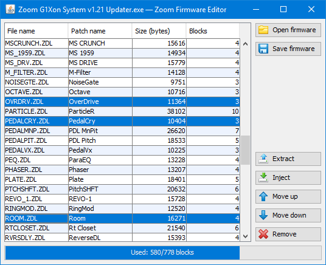

# Zoom Firmware Editor
Zoom Firmware Editor is a software for modifying guitar/bass multi-effects pedal firmware updater files. It can be used for adding, removing, swapping effects; modifying drum patterns and replacing drum sample sounds.



There are 2 types of supported pedals:
##### Multi-effect pedals that use ZDL-patch format:
```
ZOOM G1on
ZOOM G1Xon
ZOOM B1on
ZOOM B1Xon
ZOOM MS-50G
ZOOM MS-60B
ZOOM MS-70CDR
```

##### Multi-effect pedals that use ZD2-patch format:
```
ZOOM G3X
ZOOM G3n
ZOOM G3Xn
ZOOM G5n
ZOOM B3n
ZOOM AC-2
ZOOM AC-3
ZOOM G1 Four (remove "GUARDZDL.ZT2" from file table?)
ZOOM G1X Four (remove "GUARDZDL.ZT2" from file table?)
ZOOM B1 Four *
ZOOM B1X Four *

* Firmware updaters for "B1 Four" and "B1X Four" are not yet available (april 2019).
```
It seems that both pedal types are not compatible with each other: ZDL-type pedals cannot use ZD2-patches and vice versa.

For example, if your multi-effect processor is "G1on", then you can add effects from "B1on", "MS-50G", "MS-60B" (ZDL). But you can't add effects from "G5n", "AC-2" or "B3n" (ZD2).

##### Not supported pedals:
```
ZOOM G3
ZOOM G5
ZOOM B3
ZOOM MS-100BT
Other discontinued products
```

## Getting Started
Zoom Firmware Editor application is a self-executable jar-file. If you have Java JRE installed, then double-click on "ZoomFirmwareEditor.jar" should launch it.

If you dont have Java installed on your computer, you can download and run "ZoomFirmwareEditor-setup.exe". That setup application will install the compiled Windows executable with embedded JVM (created using Excelsior JET).

**Important notice!** If you are going to inject any **GUITAR** amplifier patch into any **BASS** pedal firmware, then you should inject the file **"CMN_DRV.ZDL"** too! 

## Requirements
* Java 8 or later
* Original ZOOM firmware updaters (Windows versions, available from https://www.zoom.co.jp/)

## Technical information
*This chapter may contain some incorrect of false information!*

##### RAW Audio sample format
* Encoding: Signed 16-bit PCM
* Byte order: Little-endian
* Channels: 1 channel (mono)?
* Sample rate: 44100 Hz

##### File table beginning: system info (8 bytes)
* 2nd byte: always "A5"
* 4th byte: "01" (G1on, B1on, MS-50G) or "05" (G3n, G5n, B3n)
* 5th byte may be used as a flag: "FF" = list is use; "00" = list is not in use<br/>
If value is "FF", then 1st and 3rd bytes have maximum value among all 4 lists
* 6th, 7th, 8th bytes are always "FF FF FF"

##### File table item (32 bytes)
* 2 bytes (0-1): address (block nr)
* 2 bytes (2-3): "01 FF"
* 4 bytes (4-7): size
* 12 bytes (8-19): filename, followed by "00"
* 12 bytes (20-31): "FF FF FF FF FF FF FF FF FF FF FF FF"

##### File (patch) content block
Block size is 4096 bytes.<br/>
Structure of content block:
* 2 bytes (0-1): previous address; "FF FF" for the first block
* 2 bytes (2-3): next address; "FF FF" for the last block
* 2 bytes (4-5): data size (in current block)
* 4090 bytes (6-4095): content data; followed by "FF", if data size is lesser than 4090 bytes

##### Patch order
Patch order can be organized by using FLST_SEQ.ZDT/FLST_SEQ.ZT2 files. In the current version of Zoom Firmware Editor those files are not used (and automatically excluded from the firmware: that gives 2 extra blocks of free space). Patch file order is achieved by sorting the file table. That kind of sorting is limited: patches are still grouped by the effect type.

## TODO
* Detect bass firmwares and show CMN_DRV.ZDL requirement notification when patch is missing
* Separate file filters for ZDL and ZD2
* Drum pattern editor
* Drum sample sound editor or just a menu for replacing sound files (raw-file replacing is already possible)
* Localization
* Code refactoring?

## Acknowledgments
I would like to thank the Youtube user **compashthefirst** for the idea of that project. The main algorithm of swapping effects on ZOOM pedals is based on his video tutorial.

## License
This project is licensed under the MIT License - see the [LICENSE.md](LICENSE.md) file for details.

Button icons used in this software are licensed under a Creative Commons Attribution-Share Alike 3.0 License. Ownership and copyright of the icons remains the property of Aha-Soft.
